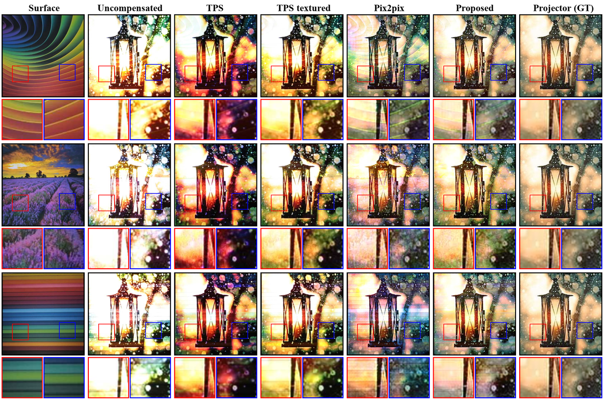
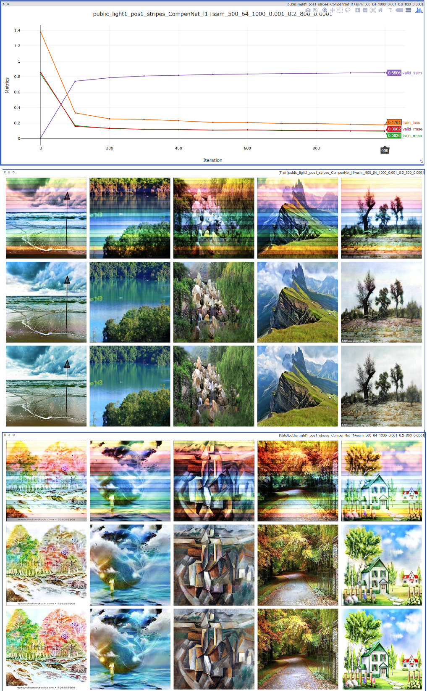
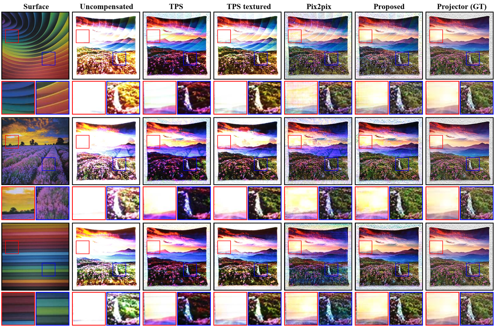
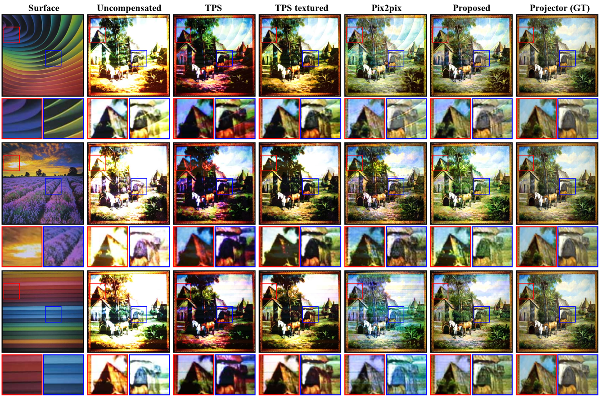

  

End-to-end Projector Photometric Compensation (to appear in CVPR'19)
  
===

## Introduction
PyTorch implementation of [CompenNet][1].

Highlights:
* For the first time, we formulate the compensation problem as an end-to-end learning problem and propose a convolutional neural network, named **CompenNet**, to implicitly learn the complex compensation function.
* A novel evaluation benchmark, which is independent of system setup and thus quantitatively verifiable. Such benchmark is not previously available.
* Our method is evaluated carefully on the benchmark, and the results show that our end-to-end learning solution outperforms state-of-the-arts both qualitatively and quantitatively by a significant margin.

For more info please refer to our [CVPR'19 paper][1] and [supplementary material][2].

## Prerequisites
* PyTorch compatible GPU
* Python 3
* PyTorch >= 0.4.0
* opencv-python 3.4.4
* visdom (for visualization)

## Usage
### 

1. Clone this repo:
   
        git clone https://github.com/BingyaoHuang/CompenNet
        cd CompenNet

2. Install required packages by typing
   
        pip install -r requirements.txt
    

3. Download CompenNet [benchmark dataset][3] and extract to [`CompenNet/data`](data)

        
4. Start **visdom** by typing

        visdom

5. Once visdom is successfully started, visit [`http://localhost:8097`](http://localhost:8097)
6. Run [`main.py`](src/python/main.py) to start training and testing

        python main.py
7. The training and validation results are updated in the browser during training. An example is shown below, where the 1st figure shows the training and validation loss, rmse and ssim curves. The 2nd and 3rd montage figures are the training and validation pictures, respectively. In each montage figure, the **1st rows are the camera captured uncompensated images, the 2nd rows are CompenNet predicted projector input images and the 3rd rows are ground truth of projector input image**. 
   

----
## Apply CompenNet to your own setup

1. For a planar textured projection surface, adjust the camera-projector such that the brightest projected input image (plain white) slightly overexposes the camera captured image. Similarly, the darkest projected input image (plain black) slightly underexposes the camera captured image. This allows the projector dynamic range to cover the full camera dynamic range.
2. Project and capture the images in `CompenNet/data/train` and `CompenNet/data/test`.
3. Project and capture a surface image `CompenNet/data/ref/img_gray`.
4. Project and capture a [checkerboard image](doc/checkerboard.png).
5. Estimate the homography `H` between camera and projector image, then warp the camera captured images `train`, `test` and `img_gray` to projector's view using `H`. 
6. Finally save the warped images to `CompenNet/data/light[n]/pos[m]/warp/[surface]/train`,  `CompenNet/data/light[n]/pos[m]/[surface]/warp/test` and  `CompenNet/data/light[n]/pos[m]/[surface]/warp/ref`, respectively, where `[n]` and `[m]` are lighting setup index and position setup index, `[surface]` is projection surface's name.

----
## Implement your own CompenNet model
1. Create a new class e.g, `CompenNetImproved` in [`CompenNetModel.py`](src/python/CompenNetModel.py).
2. Put the new class name string in `model_list`, e.g., `model_list = [CompenNet, CompenNetImproved]` in [`main.py`](src/python/main.py).
3. Run `main.py`.
4. The validation results will be saved to `%Y-%m-%d_%H_%M_%S.txt` and an example is shown below.

### 

    data_name              model_name   loss_function   num_train  batch_size  max_iters  uncmp_psnr  uncmp_rmse  uncmp_ssim  valid_psnr  valid_rmse  valid_ssim
    light2/pos1/curves     CompenNet    l1+ssim         500        64          1000       14.3722     0.3311      0.5693      23.1205     0.1209      0.7943    
    light2/pos1/squares    CompenNet    l1+ssim         500        64          1000       10.7664     0.5015      0.5137      20.1673     0.1699      0.7045    
    light1/pos1/stripes    CompenNet    l1+ssim         500        64          1000       15.1421     0.3030      0.6264      24.9245     0.0983      0.8508    
    light2/pos2/lavender   CompenNet    l1+ssim         500        64          1000       13.1573     0.3808      0.5665      22.1861     0.1347      0.7693    
    light2/pos2/squares    CompenNet    l1+ssim         500        64          1000       12.6103     0.4056      0.5664      21.5523     0.1449      0.7523    
    light4/pos2/curves     CompenNet    l1+ssim         500        64          1000       11.2058     0.4767      0.5187      22.0896     0.1362      0.7863    
    light4/pos3/stripes    CompenNet    l1+ssim         500        64          1000       12.8709     0.3936      0.5906      24.1882     0.1069      0.8372    
    light2/pos4/curves     CompenNet    l1+ssim         500        64          1000       14.1748     0.3387      0.4935      21.6459     0.1433      0.7456    
    light2/pos5/cloud      CompenNet    l1+ssim         500        64          1000       11.7495     0.4478      0.5090      20.9175     0.1558      0.7180    
    light1/pos3/cubes      CompenNet    l1+ssim         500        64          1000       12.0603     0.4321      0.4097      21.7708     0.1413      0.7395    
    light1/pos4/curves     CompenNet    l1+ssim         500        64          1000       10.1341     0.5393      0.4714      20.3300     0.1667      0.7388    
    light2/pos5/lavender   CompenNet    l1+ssim         500        64          1000       13.3880     0.3708      0.5214      21.8156     0.1405      0.7447    
    light2/pos5/squares    CompenNet    l1+ssim         500        64          1000       9.8349      0.5582      0.4686      19.1726     0.1905      0.6687    
    light2/pos5/stripes    CompenNet    l1+ssim         500        64          1000       12.3792     0.4165      0.5314      21.0629     0.1533      0.7416    
    light1/pos5/cubes      CompenNet    l1+ssim         500        64          1000       11.7220     0.4492      0.3847      21.4928     0.1459      0.7141    
        
## More Qualitative Comparison Results

    
## Citation
Please cite these papers in your publications if it helps your research:

    @inproceedings{huang2019compennet,
        author = "Huang, Bingyao and Ling, Haibin",
        title = "End-to-end Projector Photometric Compensation",
        year = "2019",
        booktitle = "IEEE Computer Society Conference on Computer Vision and Pattern Recognition (To appear)"
    }

## Acknowledgments
The PyTorch implementation of SSIM loss is modified from [Po-Hsun-Su/pytorch-ssim](https://github.com/Po-Hsun-Su/pytorch-ssim).

## License
This software is freely available for non-profit non-commercial use, and may be redistributed under the conditions in [license](LICENSE).

[1]: https://arxiv.org/pdf/1904.04335
[2]: http://www.dabi.temple.edu/~hbling/publication/CompenNet_sup.pdf
[3]: http://bit.ly/2G5iTfY
[4]: https://www.mathworks.com/help/vision/ref/detectcheckerboardpoints.html
[5]: https://github.com/BingyaoHuang/single-shot-pro-cam-calib/tree/ismar18
[6]: https://youtu.be/fnrVDOhcu7I
[7]: http://www.vision.caltech.edu/bouguetj/calib_doc/htmls/calib_example/index.html

